# MongoDB Compass dan Shell

## MongoDB Compass
* ### Langkah 1
> Melakukan koneksi ke MongoDB menggunakan connection string.  
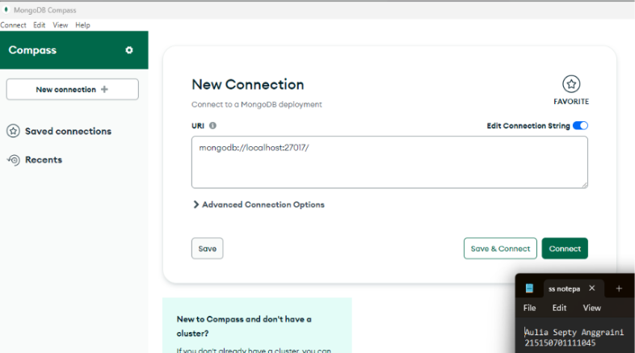

* ### Langkah 2
> Membuat database dengan klik “Create Database”  

* ### Langkah 3
> Melakukan insert buku pertama dengan klik “Add Data”, pilih “Insert Document”, isi dengan data yang diinginkan dan klik “Insert”  
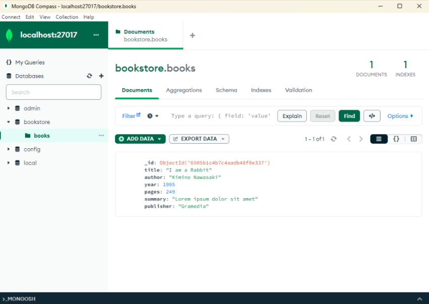

* ### Langkah 4
> Melakukan insert buku kedua dengan cara yang sama.  
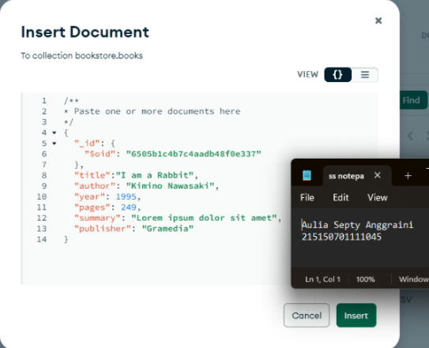

* ### Langkah 5
> Melakukan pencarian buku dengan author “Kimino Nawasaki” dengan mengisi filter yang diinginkan dan klik “Find”  
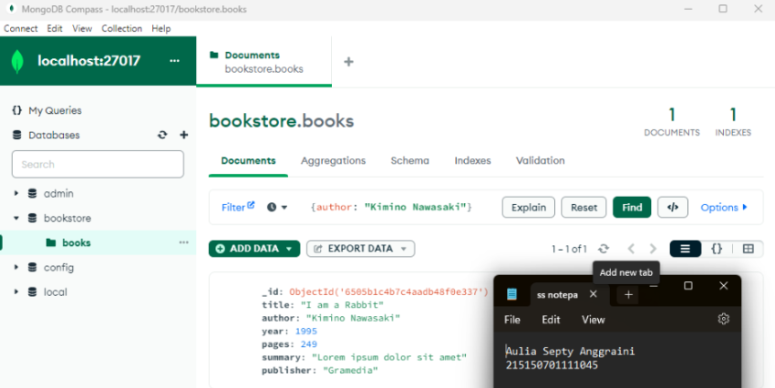

* ### Langkah 6
> Melakukan perubahan summary pada buku “Lorem ipsum dolor sit amet” menjadi “Buku yang bagus (<NAMA>,<NIM>) dengan klik “Edit Document” (berlambang pensil), mengisi nilai summary yang baru, dan klik “Update”  
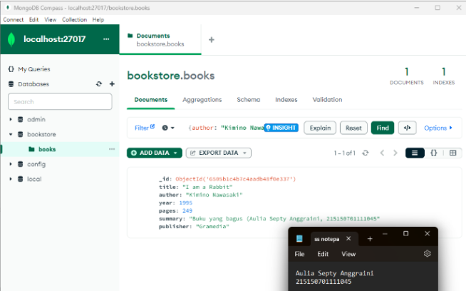

* ### Langkah 7
> Melakukan penghapusan pada buku “I Am a Rabbit” dengan klik “Remove Document" (berlambang tong sampah) dan klik “Delete"  
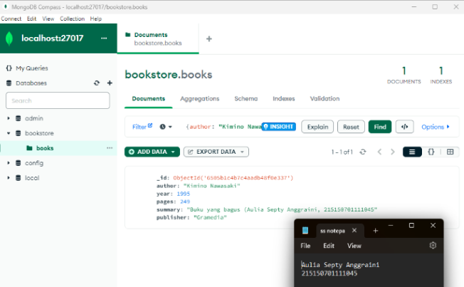

## MongoDB Shell
* ### Langkah 1
> Melakukan koneksi ke MongoDB Server dengan menjalankan perintah mongosh bagi yang menggunakan terminal build in OS sehingga tampilan terminal kalian akan menjadi seperti berikut  
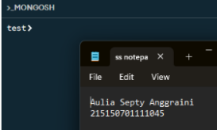

* ### Langkah 2
> Melihat list database yang ada di server dengan menjalankan perintah show dbs  
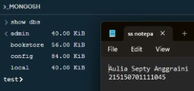

> Berpindah ke database “bookstore” menggunakan perintah use bookstore  
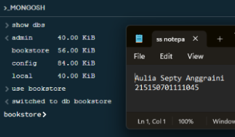

> Melihat collection yang ada pada database tersebut dengan menggunakan perintah show collections  
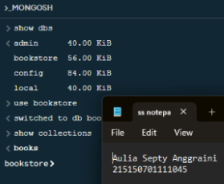

* ### Langkah 3
> Melakukan insert buku “Overlord I” menggunakan perintah db.books.insertOne(<data kalian>), setelah insert buku berhasil maka MongoDB akan mengembalikan pesansebagai berikut.  
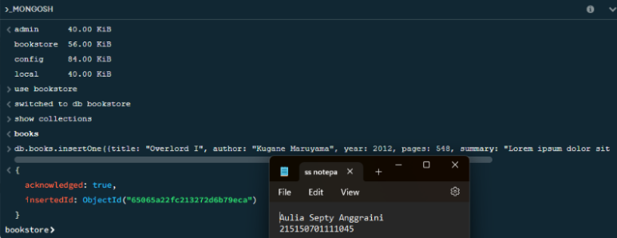

* ### Langkah 4
> Melakukan insert buku “The Setting Sun” dan “Hujan” dengan insert many menggunakan perintah db.books.insertMany(<data kalian>) , dan akan mengembalikan pesan sebagai berikut.  
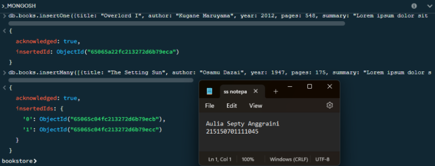

* ### Langkah 5
> Melakukan pencarian buku dengan menggunakan perintah db.books.find() untuk pencarian semua buku.  
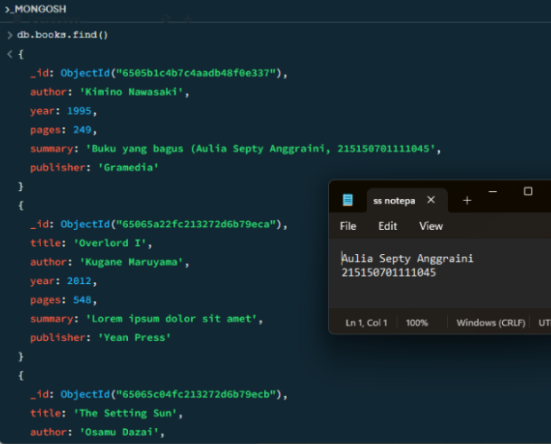

* ### Langkah 6
> Menampilkan seluruh buku dengan author “Osamu Dazai” menggunakan perintah db.books.find({<filter yang ingin diisi>}).  
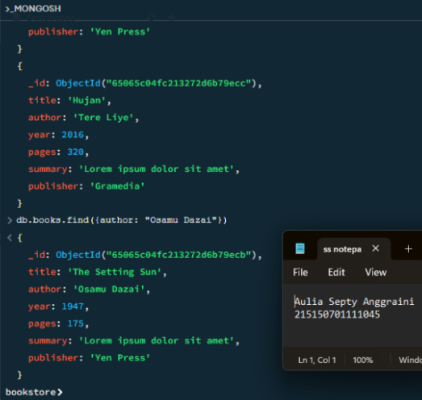

* ### Langkah 7
> Melakukan perubahan summary pada buku “Hujan” menjadi “Buku yang bagus (<NAMA>,<NIM>) mengunakan perintah db.books.updateOne({<filter>}, {$set: {<data yang akan di update>}}) sehingga output yang dihasilkan oleh MongoDB akan menjadi seperti berikut.  

* ### Langkah 8
> Melakukan perubahan publisher menjadi “Yen Press” pada semua buku “Osamu Dazai” dengan menggunakan perintah db.books.updateMany({<filter>}, {$set: {<data yang akan di update>}}).  
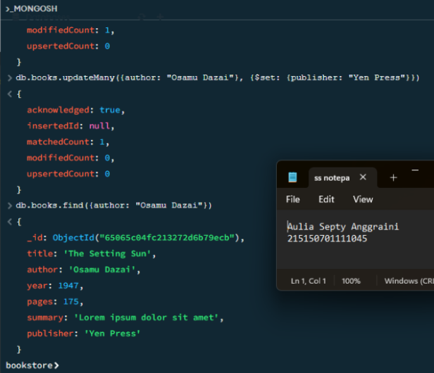

* ### Langkah 9
> Melakukan penghapusan pada buku “Overlord I” dengan menggunakan perintah db.books.deleteOne({<argument>})  
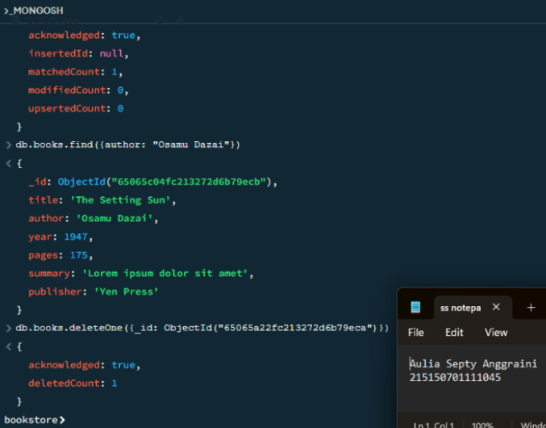

* ### Langkah 10
> Melakukan penghapusan pada semua buku “Osamu Dazai dengan menggunakan perintah db.books.deleteMany({<argument>})  
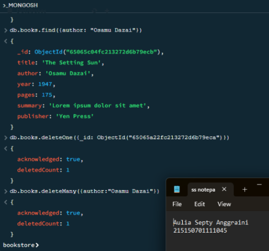