# Integrasi MongoDB dan Express

## Percobaan instalasi NodeJS
* ### Langkah 1
> Membuka halaman

* ### Langkah 2
> Download dan jalankan node setup  

* ### Langkah 3
> Setelah instalasi selesai jalankan command node -v untuk memeriksa apakah NodeJS sudah terinstall.  
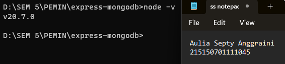

## Inisiasi project Express dan pemasangan package
* ### Langkah 1
> Melakukan pembuatan folder dengan nama express-mongodb dan masuk ke dalam folder tersebut lalu buka melalui text editor masing-masing

* ### Langkah 2
> Melakukan npm init untuk mengenerate file package.json dengan menggunakan command npm init -y
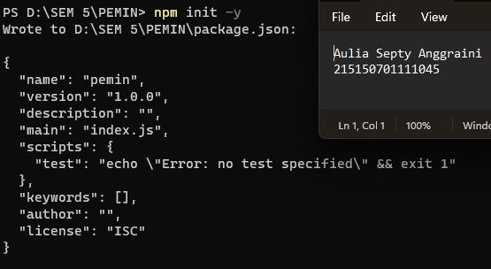  

* ### Langkah 3
> Melakukan instalasi express, mongoose, dan dotenv dengan menggunakan command npm i express mongoose dotenv. 
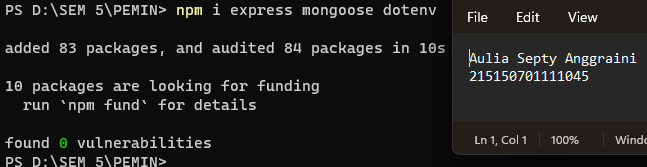

## Koneksi Express ke MongoDB
* ### Langkah 1
>Buatlah file index.js pada root folder dan masukkan kode di bawah ini
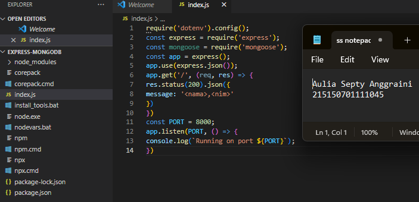

* ### Langkah 2
> Melakukan pembuatan file .env dan masukkan baris berikut
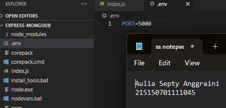  
>Setelah itu ubahlah kode pada listening port menjadi berikut dan coba jalankan aplikasi kembali
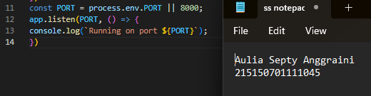 
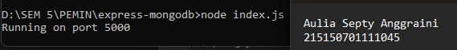 

* ### Langkah 3
> Copy connection string yang terdapat pada compas atau atlas dan paste kan pada .env seperti berikut 
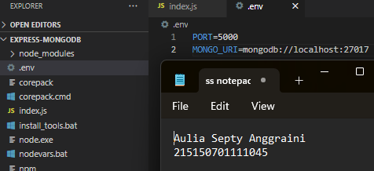

* ### Langkah 4
> Menambahkan baris kode berikut pada file index.js
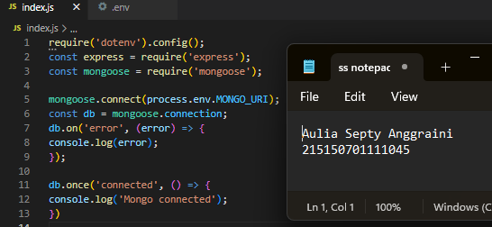
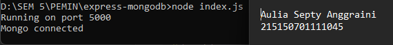

## Pembuatan Routing
* ### Langkah 1
>Melakukan pembuatan direktori routes di tingkat yang sama dengan index.js
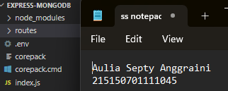

* ### Langkah 2
> Buatlah file book.route.js di dalamnya
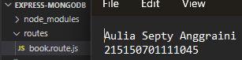  

* ### Langkah 3
> Menambahkan baris kode berikut untuk fungsi getAllBooks 
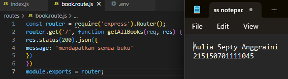

* ### Langkah 4
> Melakukan hal yang sama untuk getOneBook, createBook, updateBook, dan deleteBook
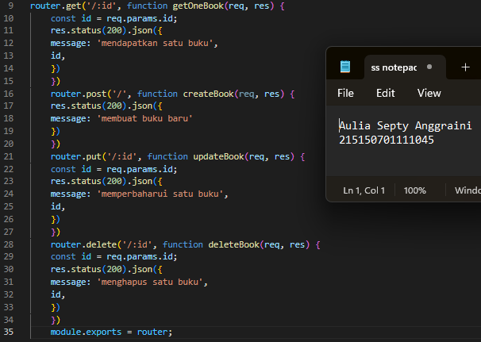

* ### Langkah 5
> Melakukan import book.route.js pada file index.js dan Menambahkan baris kode berikut 
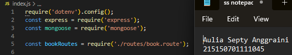
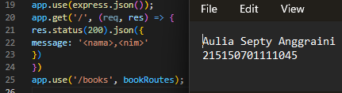

* ### Langkah 6
> Uji salah satu endpoint dengan Postman 
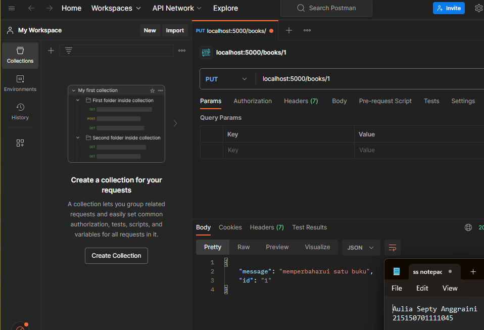

## Pembuatan Controller
* ### Langkah 1
>Melakukan pembuatan direktori controllers di tingkat yang sama dengan index.js
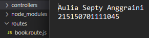

* ### Langkah 2
> Buatlah file book.controller.js di dalamnya
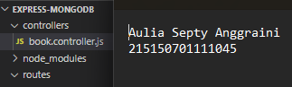  

* ### Langkah 3
> Salin baris kode dari routes untuk fungsi getAllBooks 
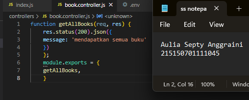

* ### Langkah 4
> Melakukan hal yang sama untuk getOneBook, createBook, updateBook, dan deleteBook
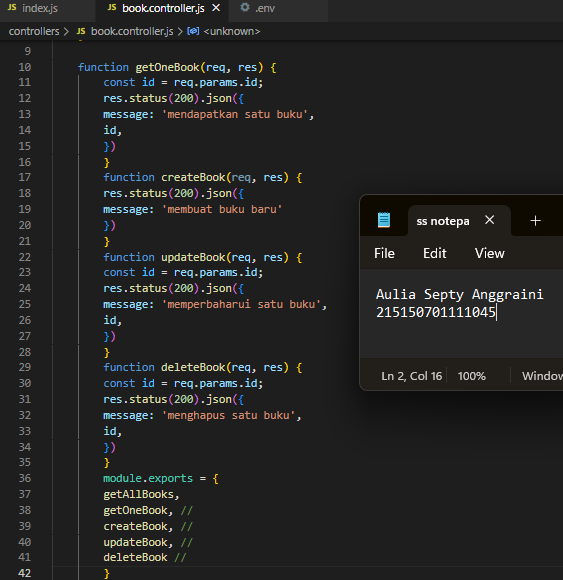

* ### Langkah 5
> Melakukan import book.controller.js pada file book.route.js 
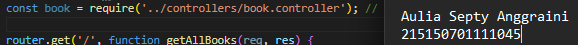

* ### Langkah 6
> Melakukan perubahan pada fungsi agar dapat memanggil fungsi dari book.controller.js 
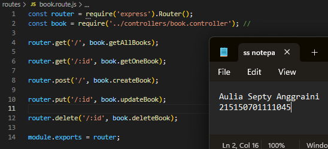

* ### Langkah 7
> Melakukan pengujian kembali, pastikan response tetap sama
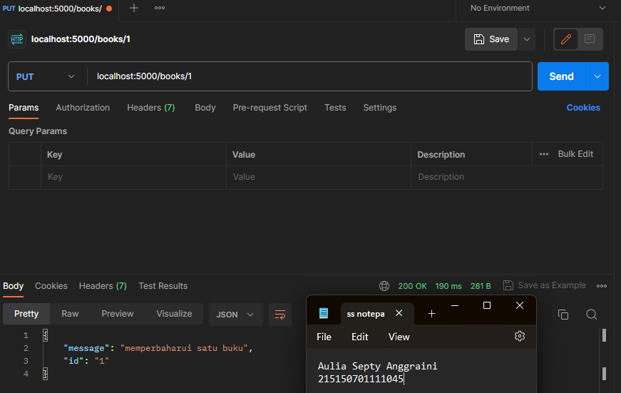

## Pembuatan Model
* ### Langkah 1
>Melakukan pembuatan direktori models di tingkat yang sama dengan index.js
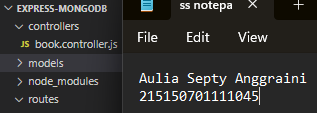

* ### Langkah 2
> Buatlah file book.model.js di dalamnya
  

* ### Langkah 3
> Menambahkan baris kode berikut sesuai dengan tabel di atas 

## Operasi CRUD
* ### Langkah 1
>Hapus semua data pada collection books
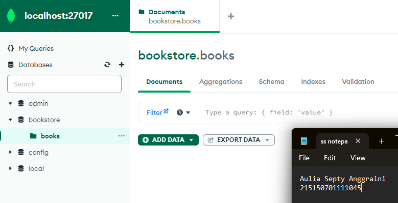

* ### Langkah 2
> Melakukan import book.model.js pada file book.controller.js
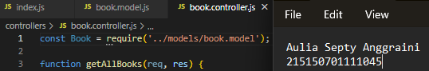  

* ### Langkah 3
> Melakukan perubahan pada fungsi createBook
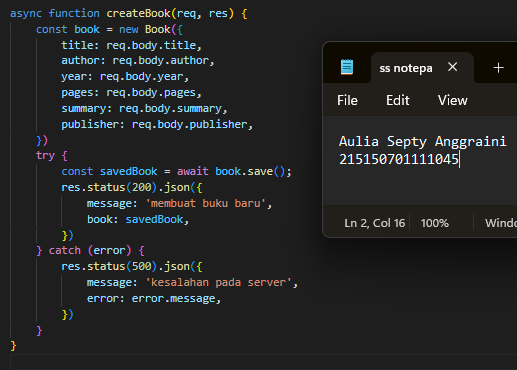

* ### Langkah 4
> Buatlah dua buah buku dengan data di bawah ini dengan Postman
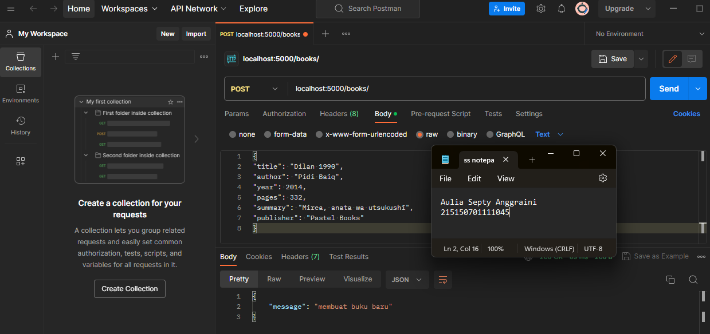
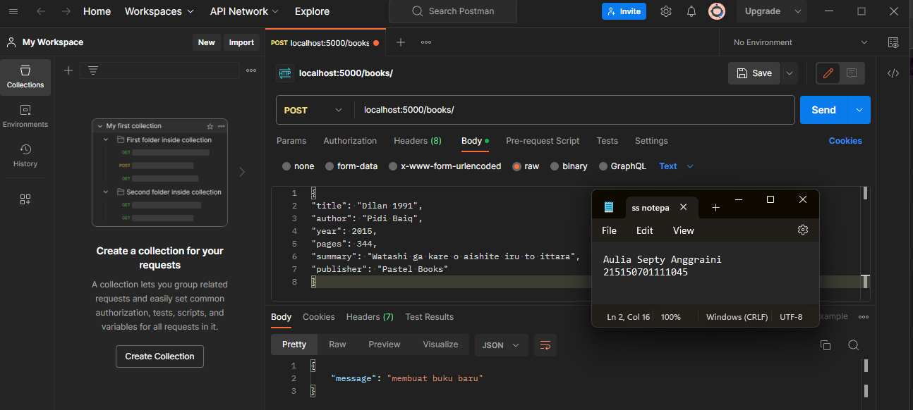

* ### Langkah 5
> Melakukan perubahan pada fungsi getAllBooks 
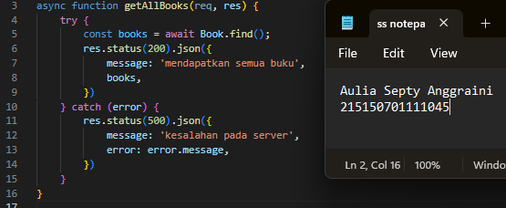

* ### Langkah 6
> Melakukan perubahan pada fungsi getOneBook 
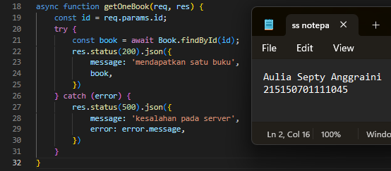

* ### Langkah 7
> Menampilkan semua buku dengan Postman dengan perintah GET lalu masukkan url localhost:5000/books untuk mencari semua buku
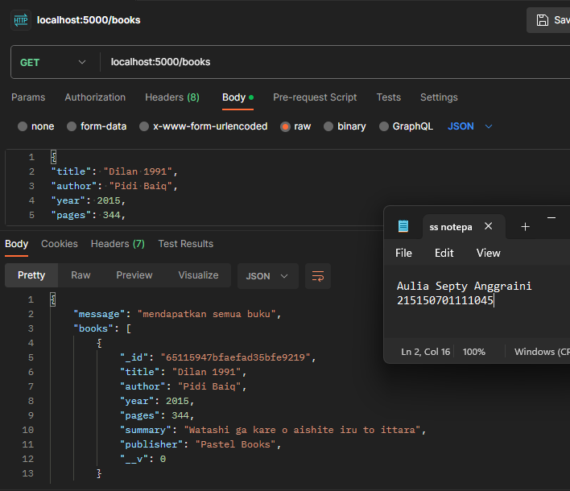

* ### Langkah 8
> Menampilkan buku Dilan 1990 dengan Postman menggunakan perintah GET dan masukkan id buku Dilan 1990 
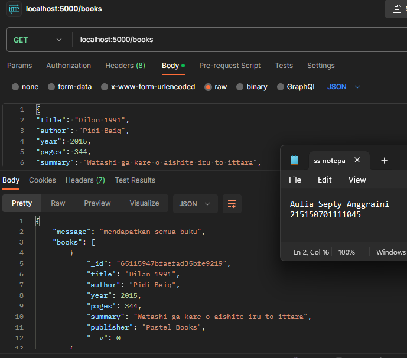

* ### Langkah 9
> Melakukan perubahan pada fungsi updateBook dengan syntax berikut 
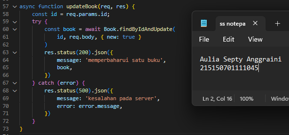

* ### Langkah 10
> Mengubah judul buku Dilan 1991 menjadi “<NAMA PANGGILAN> 1991” dengan Postman, disini saya mengganti dengan nama “SAnggi 1991” 
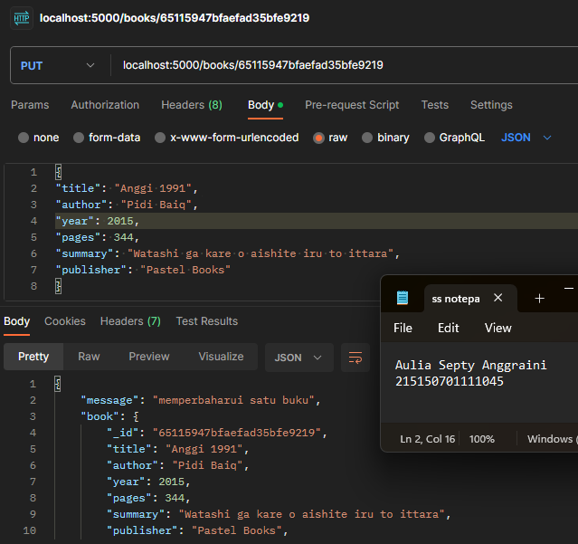

* ### Langkah 11
>Melakukan perubahan pada fungsi deleteBook dengan syntax berikut 
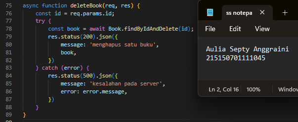

* ### Langkah 12
> Menghapus buku Dilan 1990 dengan Postman menggunakan perintah DELETE lalu masukkan id dari buku 
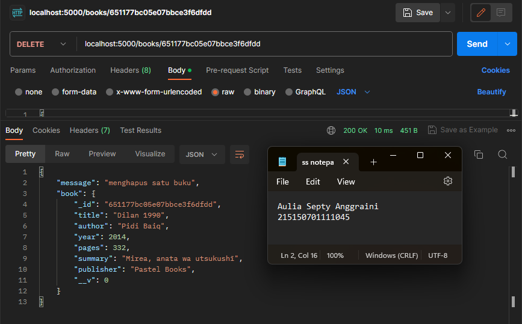