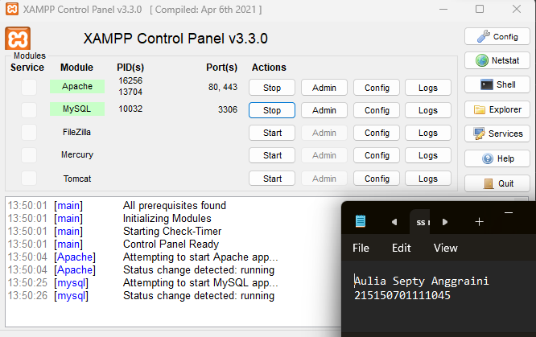

# Basic Routing dan Migration  

## Langkah Percobaan  
* ### 1. GET
Untuk menambahkan endpoint dengan method GET pada aplikasi kita, kita dapat mengunjungi file web.php pada folder routes. Kemudian tambahkan baris ini pada akhir file  
  
Setelah itu coba jalankan aplikasi dengan command,  
  
Setelah aplikasi berhasil dijalankan, kita dapat membuka browser dengan url, http://localhost:8000/get , path yang akan kita akses akan berbentuk demikian, http://{BASE_URL}{PATH} ,  
  
jika BASE_URL kita adalah localhost:8000 dan PATH kita adalah /get , maka url akan berbentuk seperti diatas.  

* ### 2. POST, PUT, PATCH, DELETE, dan OPTIONS
Sama halnya saat menambahkan method GET, kita dapat menambahkan methode POST, PUT, PATCH, DELETE, dan OPTIONS pada file web.php dengan code seperti ini,   
  
Setelah selesai menambahkan route untuk method POST, PUT, PATCH, DELETE, dan OPTIONS, kita dapat menjalankan server seperti pada saat percobaan GET. Setelah server berhasil menyala, kita dapat membuka aplikasi Postman atau Insomnia atau kita juga dapat menggunakan PowerShell (Windows) / Terminal (Linux atau Mac) untuk melakukan request ke server. Namun, pada percobaan kali ini kita akan menggunakan extensions pada VSCode yaitu Thunder Client.  

a. Menginstall ekstensi dengan membuka panel extensions lalu mencari thunder client  
  

b. Setelah menginstall Thunder Client, akan melihat logo seperti petir pada activity bar kita (sebelah kiri).  
  

c. Membuat request dengan menekan "New Request" pada ekstensi  
  

d. Setelah itu kita dapat memasukkan method dan url yang dituju  
  

e. Akses url yang baru saja ditambahkan pada aplikasi dengan methodnya  
  

* ### Migrasi Database
a. Sebelum melakukan migrasi database pastikan server database aktif kemudian pastikan sudah membuat database dengan nama lumenapi  
  
b. Kemudian ubah konfigurasi database pada file .env menjadi seperti ini  
  

c. Setelah mengubah konfigurasi pada file .env, kita juga perlu menghidupkan beberapa library bawaan dari lumen dengan membuka file app.php pada folder bootstrap dan mengubah baris ini,  
//$app->withFacades();  
//$app->withEloquent();  

Menjadi,  

$app->withFacades();  
$app->withEloquent();  
  

d. Setelah itu jalankan command berikut untuk membuat file migration,  
php artisan make:migration create_users_table # membuat migrasi untuk tabel users  
php artisan make:migration create_products_table # membuat migrasi untuk tabel products  

  
  

Setelah menjalankan 2 syntax diatas akan terbuat 2 file pada folder database/migrations dengan format YYYY_MM_DD_HHmmss_nama_migrasi. Pada file migrasi kita akan menemukan fungsi up() dan fungsi down(), fungsi up() akan digunakan pada saat kita melakukan migrasi, fungsi down() akan digunakan saat kita ingin me-rollback migrasi  

e. Ubah fungsi up pada file migrasi create_users_table  
  

f. Ubah fungsi up pada file migrasi create_products_table  
  

g. Kemudian jalankan command,  

php artisan migrate  
  
