# Dynamic Route dan Middleware  

## Langkah Percobaan  
* ### 1. Dynamic Route  
Dynamic route adalah route yang dapat berubah-ubah, contohnya pada saat kita membuka suatu halaman web, kadang kita melihat /users/1 atau /users/2, hal ini yang dinamakan dynamic routes.  
Untuk menambahkan dynamic routes pada aplikasi lumen kita, kita dapat menggunakan syntax berikut,  
$router->get('/user/{id}', function ($id) {  
return 'User Id = ' . $id;  
});  
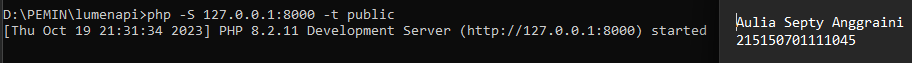  
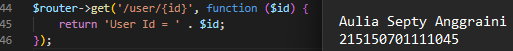  
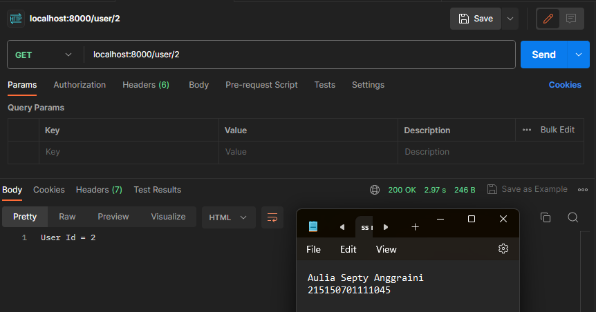  
Ketika mengakses ‘/users/userID’ maka akan mengembalikan nilai “User ID = [userID]”.  
Saat menambahkan parameter pada routes, kita tidak terbatas pada 1 variable saja,namun kita dapat menambahkan sebanyak yang diperlukan seperti kode berikut,  
$router->get('/post/{postId}/comments/{commentId}', function  
($postId, $commentId) {  
return 'Post ID = ' . $postId . ' Comments ID = ' .  
$commentId;  
});  
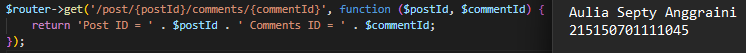  
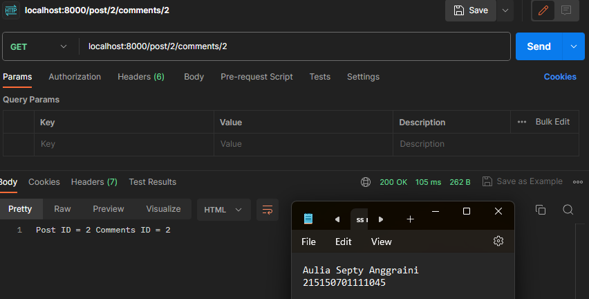  
Ketika mengakses ‘/post/postID/comments/commentsID’ maka akan mengembalikan nilai “Post ID = [postID] Comments ID = [commentsID]”.  
Pada dynamic routes kita juga bisa menambahkan optional routes, yang mana optional routes tidak mengharuskan kita untuk memberi variable pada endpoint kita, namun saat kita memanggil endpoint, dapat menggunakan parameter variable ataupun tidak, seperti
pada kode dibawah ini,  
$router->get('/users[/{userId}]', function ($userId = null) {  
return $userId === null ? 'Data semua users' : 'Data user  
dengan id ' . $userId; });  
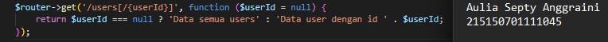  
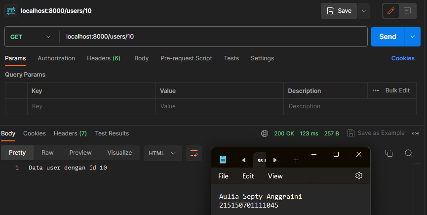  
Ketika mengakses ‘/users/userID’ maka akan mengembalikan nilai “Data user dengan ide [userID]”.  

* ### 2. Aliases Route
Aliases Route digunakan untuk memberi nama pada route yang telah kita buat, hal ini dapat membantu kita, saat kita ingin memanggil route tersebut pada aplikasi kita. Berikut syntax untuk menambahkan aliases route  
$router->get('/auth/login', ['as' => 'route.auth.login',  
function (...) {...}])  
...  
$router->get('/profile', function (Request $request) {  
if ($request->isLoggedIn) {  
return redirect()->route('route.auth.login');  
  
}  
  
});  
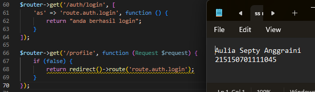  
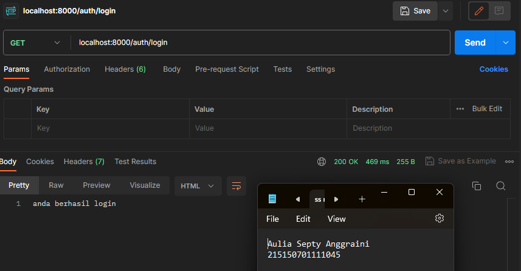  
Jika mengakses /auth/login maka akan memunculkan nilai “anda berhasil login”. Namun, ketika mengakses ke profile maka akan mendirect ke route get karena belum melakukan login.   

* ### 3. Group Route
Pada lumen, kita juga dapat memberikan grouping pada routes kita agar lebih mudah pada saat penulisan route pada web.php kita. Kita dapat melakukan grouping dengan menggunakan syntax berikut,  
$router->group(['prefix' => 'users'], function () use ($router)  
{  
$router->get('/', function () { // menjadi /users/,  
/users => prefix, / => path  
return "GET /users";  
});  
});  
Selain dapat mengelompokkan prefix, kita juga dapat mengelompokkan middleware dan namespace pada kelompok routes kita.  
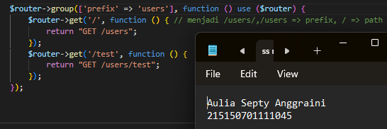  
Group route dapat mengelompokkan routing yang kita inginkan. Misal mengelompokkan route ‘test’ ke dalam group ‘users’.  
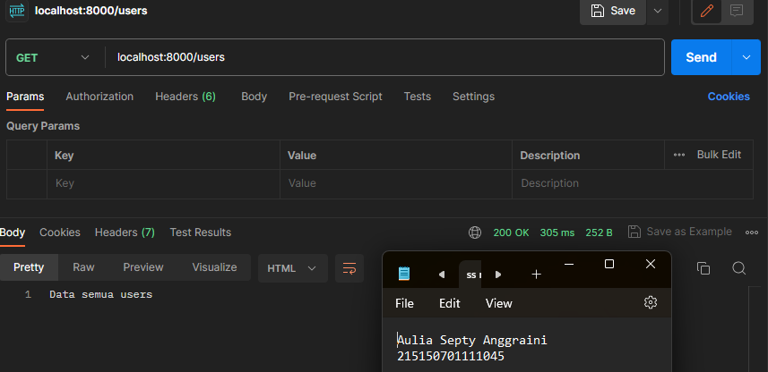  
Memanggil get /users maka mengembalikan nilai “GET /users”  
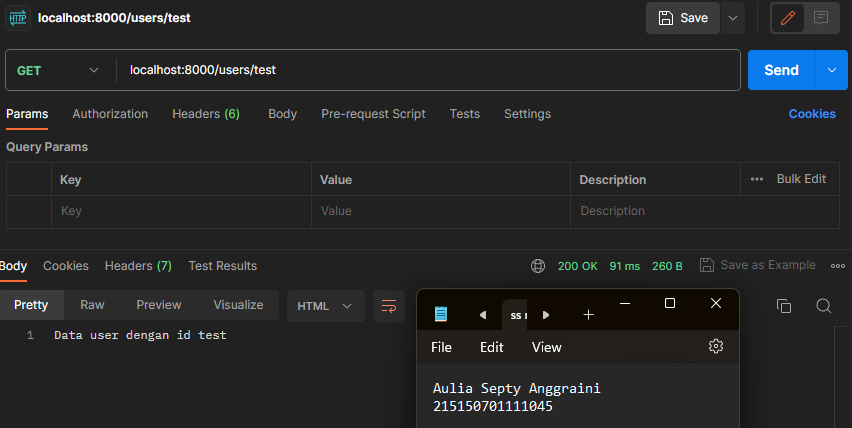  
Memanggil get /users/test maka mengembalikan nilai “GET /users/test”.  

* ### 4. Middleware
Middleware adalah penengah antara komunikasi aplikasi dan client. Middleware biasanya digunakan untuk membatasi siapa yang dapat berinteraksi dengan aplikasi kita dan semacamnya, kita dapat menambahkan middleware dengan menambahkan file pada folder app/Http/Middleware. Pada folder tersebut terdapat file ExampleMiddleware, kita dapat men-copy file tersebut untuk membuat middleware baru. 
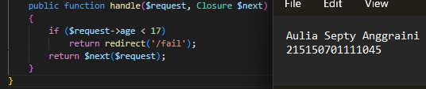  
Memastikan request yang masuk ke controller sesuai dengan fungsinya. Kemudian, setelah menambahkan filter pada AgeMiddleware, kita harus mendaftarkan AgeMiddleware pada aplikasi kita, pada file bootstrap/app.php seperti berikut ini,  
73 ...  
74  
75 // $app->middleware([  
76 // App\Http\Middleware\ExampleMiddleware::class  
77 // ]);  

78  
79 $app->routeMiddleware([  
80 // 'auth' => App\Http\Middleware\Authenticate::class,  
81 'age' => App\Http\Middleware\AgeMiddleware::class  
82 ]);  
83  
84 ...  
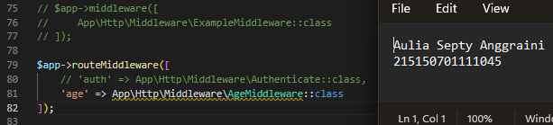  

Pada folder bootstrap file app.php, Uncomment routerMiddleware dan comment bagian auth lalu masukkan kode ‘'age' => App\Http\Middleware\AgeMiddleware::class’. Fungsinya untuk mendaftarkan middleware yang sudah dibuat yaitu AgeMiddleware.  
Pada baris 65 terdapat comment mengenai proses mendaftarkan suatu middleware dalam aplikasi kita. Untuk menambahkan middleware pada aplikasi kita, kita dapat men- uncomment baris 75 hingga 77, kemudian menambahkan age middleware ke dalamnya.  
Namun, karena kita hanya ingin menambahkan middleware pada route tertentu, kita akan menghapus comment pada baris 79 hingga 81, kemudian menambahkan middleware age di dalamnya. Lalu, kita dapat menambahkan middleware pada routes kita dengan menambahkan opsi middleware pada salah satu route, contohnya,  
$router->get('/admin/home/', ['middleware' => 'age', function ()  
{ return 'Dewasa'; }]);  
$router->get('/fail', function () {  
return 'Dibawah umur'; })  
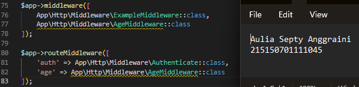  
  