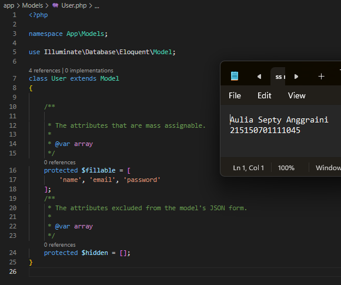
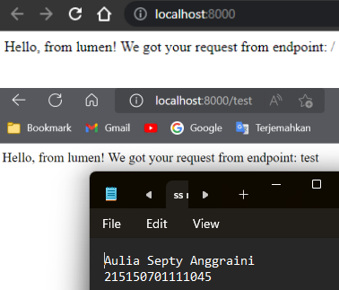
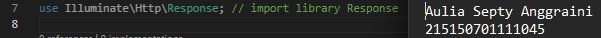

# Model, Controller dan Request-Response Handler  

## Langkah Percobaan    
* ### Model   
1. Pastikan terdapat tabel users yang dibuat menggunakan migration pada bab sebelumnya.  
  
Tabel user yang berisi informasi ide, created_at, update_at, name, email, password.  
2. Bersihkan isi User.php yang ada sebelumnya dan isi dengan baris kode berikut.  
  
Mengganti isi User.php dengan syntax yang diberikan.  

* ### Model   
1. Membuat salinan ExampleController.php pada folder app/Http/Controllers dengan nama HomeController.php dan membuat fungsi index().  
  
Membuat salinan dari file ExampleController dan mengganti nya dengan nama HomeController kemudian menambahkan fungsi index().  
2. Mengubah route / pada file routes/web.php menjadi seperti ini  
  
Menambahkan route yang merujuk ke fungsi index pada HomeController.php.  
3. Menjalankan aplikasi  
  
Menampilkan kalimat "Hello, from lumen!"  

* ### Request Handler  
1. Melakukan import library Request dengan menambahkan baris berikut di bagian atas file HomeController.php  
  
Melakukan import library Request  
2. Mengubah fungsi index  dengan paramater request  
  
3. Menjalankan aplikasi  
  
Menampilkan kalimat “Hello, from lumen! We got your request from endpoint: test” dimana kata “test” diambil dari request pada url localhost  

* ### Response Handler  
1. Melakukan import library Response dengan menambahkan baris berikut di bagian atas file Controllers  
  
Melakukan import library Response  
2. Membuat fungsi hello()  
  
Menambahkan fungsi hello() pada HomeController.php  
3. Menambahkan route /hello pada file routes/web.php  
  
4. Menjalankan aplikasi pada route /hello  
  
* ### Response Handler  
1. Melakukan import model User dengan menambahkan baris berikut di bagian atas file  Controllers  
  
Menambahkan import model User pada HomeController.php  
2. Menambahkan ketiga fungsi berikut di HomeController.php  
  
Menambahkan tiga fungsi sesuai perintah soal yaitu defaultUser(), createUser(), dan getUsers().  
3. Menambahkan ketiga route pada file routes/web.php menggunakan group route  
  
4. Menjalankan aplikasi pada route /users/default menggunakan Postman  
  
  
  