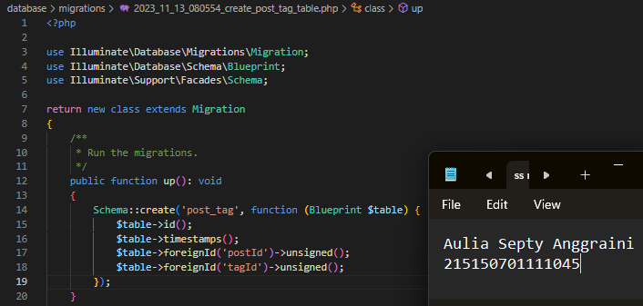
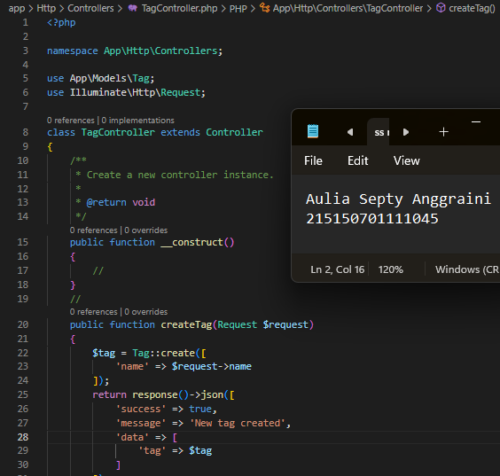

# Relasi One-to-Many dan Many-to-Many  

## Langkah Percobaan    
* ### Model   
1. Sebelum membuat migrasi database atau membuat tabel pastikan server database aktif kemudian pastikan sudah membuat database dengan nama lumenpost  
  
Membuat database lumenpost  
2. Kemudian ubah konfigurasi database pada file .env menjadi seperti berikut  
  
Mengubah konfigurasi database pada file .env  
3. Setelah mengubah konfigurasi pada file .env, kita juga perlu menghidupkan beberapa library bawaan dari lumen dengan membuka file app.php pada folder bootstrap dan diubah.  
  
Menghidupkan library bawaan dari lumen pada file app.php  
4. Setelah itu jalankan command berikut untuk membuat file migration  
  
Membuat file migration  
5. Ubah fungsi up() pada file migrasi create_posts_table  
  
Mengubah fungsi up() pada file create_posts_table.php  
6. Ubah fungsi up() pada file create_comments_table  
  
Mengubah fungsi up() pada file create_comments_table.php  
7. Ubah fungsi up() pada file create_tags_table  
  
Mengubah fungsi up() pada file create_tags_table.php  
8. Ubah fungsi up() pada file create_post_tag_table  
  
Mengubah fungsi up() pada file create_post_tak_table.php  
9. Kemudian jalankan command  
  
Berhasil menyimpan perubahan yang dilakukan  

* ### Pembuatan Model   
10. Buatlah file dengan nama Post.php dan isi dengan baris kode berikut  
  
Membuat file pada folder Models dengan nama Post.php  
11. Buatlah file dengan nama Comment.php dan isi dengan baris kode berikut  
  
Membuat file pada folder Models dengan nama Comment.php  
12. Buatlah file dengan nama Tag.php dan isi dengan baris kode berikut  
  
Membuat file dengan nama Tak.php pada filder Models  

* ### Relasi One-to-Many   
1. Tambahkan fungsi comments() pada file Post.php  
  
Menambahkan fungsi comments() pada file Post.php  
2. Tambahkan fungsi post() dan atribut postId pada $fillable pada file Comment.php  
  
Menambahkan fungsi post() dan atribut postId pada bagian $fillable di file Comment.php  
3. Buatlah file PostController.php dan isilah dengan baris kode berikut  
  
Membuat file PostController.php pada folder Controllers dan mengisi baris kode yang diberikan  
4. Buatlah file CommentController.php dan isilah dengan baris kode berikut  
  
Membuat file CommentController.php pada folder Controllers dan mengisi baris kode yang diberikan  
5. Tambahkan baris berikut pada routes/web.php  
  
Menambahkan baris kode pada file web.php di folder routes  
6. Buatlah satu post menggunakan Postman  
  
Membuat satu post menggunakan Postman  
7. Buatlah satu comment menggunakan Postman  
  
Membuat satu comment pada Postman  
8. Tampilkan post menggunakan Postman  
  
Menampilkan list post yang tersimpan  

* ### Relasi Many-to-Many  
1. Tambahkan fungsi tags() pada file Post.php  
  
Menambahkan fungsi tags() pada Post.php  
2. Tambahkan fungsi posts() pada file Tag.php  
  
Menambahkan fungsi posts() pada Tag.php  
3. Buatlah file TagController.php dan isilah dengan baris kode berikut  
  
Membuat file TagController.php dan mengisi baris kode yang diberikan  
4. Tambahkan fungsi addTag dan response tags pada PostController.php  
  
Menambahkan baris fungsi addTag dan response tags pada PostController.php  
5. Tambahkan baris berikut pada routes/web.php  
  
Menambahkan routes tag pada web.php  
6. Buatlah satu tag menggunakan Postman  
  
Membuat satu tak dengan isi “jadul”  
7. Tambahkan tag “jadul” pada post “disana engkau berdua”  
  
Menambahkan tag “jadul” pada post “disana engkau berada”  
8. Tampilkan post “disana engkau berdua” menggunakan Postman  
  
9. Buatlah postingan “tanpamu apa artinya” menggunakan Postman  
  
Membuat postingan “tanpamu apa artinya” di Postman  
10. Tambahkan tag “jadul” pada postingan “tanpamu apa artinya”  
  
Menambahkan tak “jadul” pada postingan 2  
11. Buatlah tag “lagu” menggunakan Postman  
  
12. Tambahkan tag “lagu” pada postingan “tanpamu apa artinya”  
  
13. Tampilkan post pertama  
  
14. Tampilkan post kedua  
    
Tag “jadul” yang berada pada dua post menunjukkan satu tag dapat berada di banyak post.  
Post “tanpamu apa artinya” yang memiliki dua tag menunjukkan satu post dapat memiliki banyak tag  