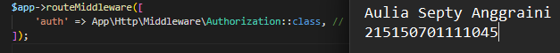

# Register, Authentication dan Authorization  

## Langkah Percobaan    
* ### Register   
1. Pastikan terdapat tabel users yang dibuat menggunakan migration pada bab 3️⃣Basic Routing dan Migration  
  
2. Pastikan terdapat model User.php yang digunakan pada bab 5️⃣Model, Controller dan Request-Response Handler.  
  
3. Buatlah file AuthController.php dan isilah dengan baris kode berikut  
  
4. Tambahkan baris berikut pada routes/web.php   
  
a. Jalankan aplikasi pada endpoint /auth/register dengan body berikut  
  

* ### Authentication  
1. Buatlah fungsi login(Request $request) pada file AuthController.php  
  
2. Tambahkan baris berikut pada routes/web.php  
  
3. Jalankan aplikasi pada endpoint /auth/login dengan body berikut  
  

* ### Token  
1. Jalankan perintah berikut untuk membuat migrasi baru  
  
2. Tambahkan baris berikut pada migration yang baru terbuat  
  
3. Tambahkan atribut token di $fillable pada User.php  
  
4. Tambahkan baris berikut pada file AuthController.php  
  
5. Jalankan perintah di bawah untuk menjalankan migrasi terbaru  
  
6. Jalankan aplikasi pada endpoint /auth/login dengan body berikut. Salinlah token yang didapat ke notepad  
  

* ### Authorization  
1. Buatlah file Authorization.php pada folder App/Http/Middleware  
  
2. Tambahkan middleware yang baru dibuat pada bootstrap/app.php.  
  
3. Buatlah fungsi home() pada HomeController.php  
  
4. Tambahkan baris berikut pada routes/web.php  
  